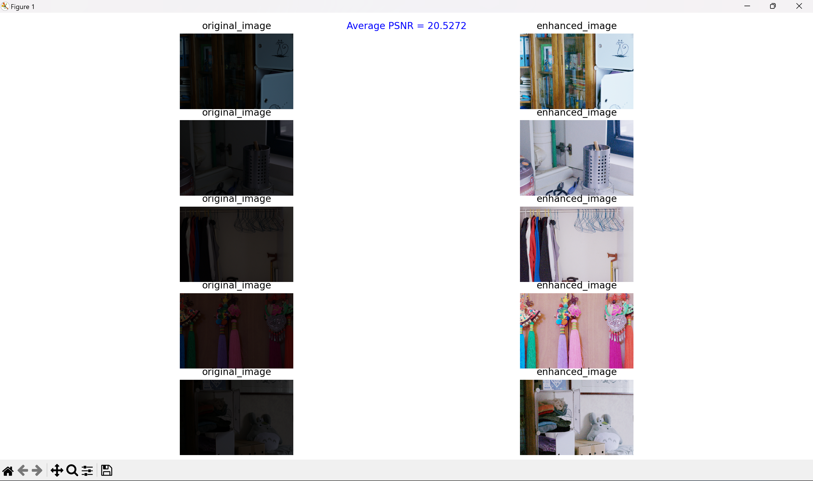

# Zero-Reference Deep Curve Estimation for Low-Light Image Enhancement
### Overview
This project implements a low-light image enhancement model using the Zero-Reference Deep Curve Estimation (Zero-DCE) method, integrated with a Dnet architecture. The model aims to dynamically adjust the tonal range of low-light images, resulting in enhanced visibility and preserved details without relying on paired reference images during training.
 
    
## Installing Required Libraries/Packages
```
pip install numpy
pip install pillow
pip install glob
pip install matplotlib
python install tenserflow  or  ( python -m pip install tensorflow[and-cuda] , if GPU user )
```

### Version Requirements
1. Python 3.11.0 (=>)
2. Tenserflow 2.16.1 (=>)

### Cloning this repositry
Run the following command to clone this repositry into your Locals
```
git clone https://github.com/anshRastogi02/Extreme-Low-Light-Image-Denoising.git
```
## Folder structure
The following shows the basic folder structure of this repositry.
```
├── dataset                   #LOL_dataset
│   ├── test                  # 15 images
│   │   ├── high              # Low exposured test images
│   │   └── low               # High exposured test images
│   │   └── predicted         # Enhanced images
│   └── train                 # 485 images
│   │   ├── high              # Low exposured train images
│   │   └── low               # High exposured train images
│   │   └── predicted         # Enhanced images
|   
├── Model               
│   ├── Losses.py             # Compute Loss Functions  
│   └── nn_architecture.py    # D-NET Arcitecture Model
│   └── ZeroDCE.py            #  ZeroDCE Model
|   |
├── saved_weights             
│   └── w1.h5                 # Saved weights of ZeroDCE model trained on dataset/train/low images
│   
├── config.py                 # Project Configuration
├── Dataset.py                # Data Preprocessing
├── main.py                   # Loads a saved model and gives Average PSNR value and plots original vs enhanced images
├── plot_PSNR.py              # Gives PSNR value of saved enhanced test/train images
├── PSNR.py                   # Outputs PRNR value 
├── test.py                   # Tests the model on test images and saves them to predicted folder
├── train_util.py             # Utilities to train the model
├── train.py                  # Training the Model on dataset/train/low
└──Visualise.py               # Visualise dataset
```
## Download Dataset
We are using LOL_dataset to train the model. The Low-Light (LOL) dataset is employed for training and evaluating the low-light enhancement model. This dataset is specifically designed to address the challenges associated with enhancing low-light images, including noise and poor visibility.
The LOL dataset is composed of 500 low-light and normal-light image pairs and is divided into 485 training pairs and 15 testing pairs.
# Dataset Composition
1. Total Image Pairs: 500 pairs.
2. Training Set: 485 images.
3. Testing Set: 15 pairs of low-light and normal-light images.
4. Resolution: Each image has a resolution of 400×600 pixels.
   
Download the dataset <a href="https://www.kaggle.com/datasets/soumikrakshit/lol-dataset">from kaggle</a> or <a href="">Google Drive</a>
Unzip the folder and put the folders in dataset directory as described in Folder Structure

## Training: 
Follow these commands to train the model using train_image_files
1. Open Terminal
2. cd Extreme-Low-Light-Image-Denoising Directory
```
python train.py
```
This script will train the ZeroDCE model on train_dataset using D-Net Architecture and saves the trained weights in saved_weights Directory.
w1.py was trained and validated on LOL_dataset's 485 training image files. 

**Note:** You can train your own model using different dataset and save the weights to reuse them.

## Testing: 
Follow these commands to process test_image_files
1. Open Terminal
2. cd Extreme-Low-Light-Image-Denoising Directory
3. Run 
```
python test.py 
```
The script will process from images in the sub-folders of "dataset/test/low" directory and uploads the result in "dataset/test/predicted" directory.

**Note**: You can change the INPUT_DIR to process the image and get the output enhanced images in OUTPUT_DIR.

## Results
On testing the the test_image_files we got significant enhancement in the low exposured image files. Enhanced images are closely resembling the ground truth images in terms of luminance and detail preservation. 
Average PSNR achieved is **( 23.5 - 24 )**



## Bibtex
```
@misc{guo2020zeroreference,
    title={Zero-Reference Deep Curve Estimation for Low-Light Image Enhancement},
    author={Chunle Guo and Chongyi Li and Jichang Guo and Chen Change Loy and Junhui Hou and Sam Kwong and Runmin Cong},
    year={2020},
    eprint={2001.06826},
    archivePrefix={arXiv},
    primaryClass={cs.CV}
}
```

(Full paper: https://arxiv.org/pdf/2001.06826v2)
